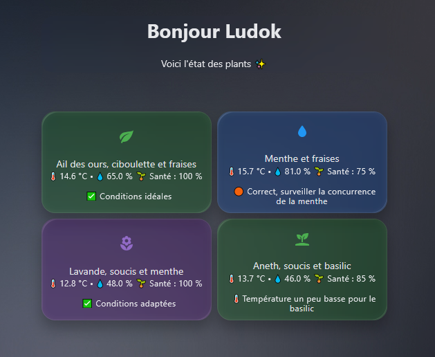
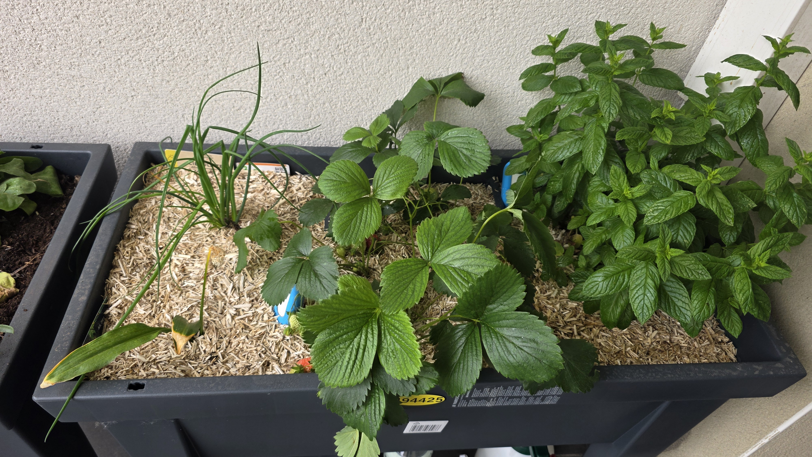
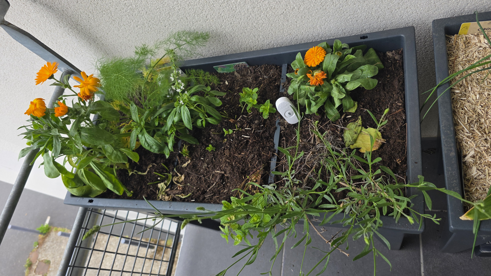
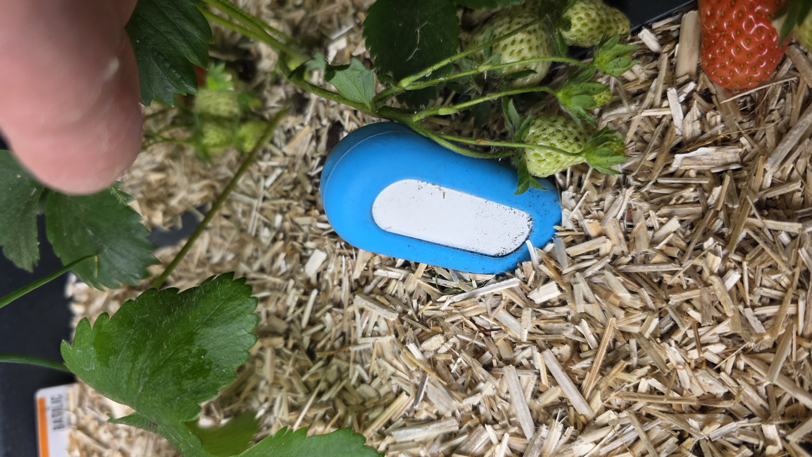
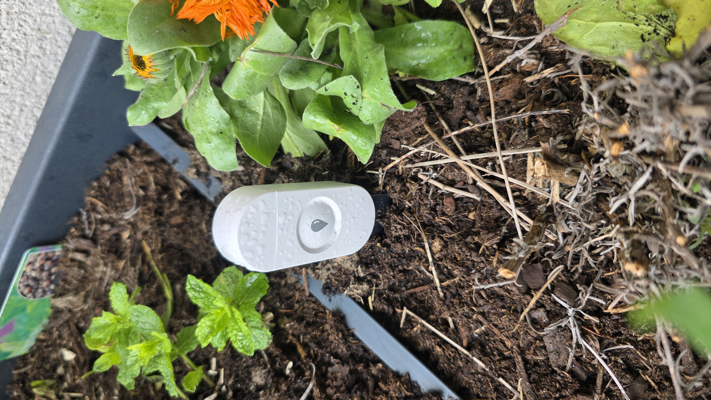

# 🌱 Smart Balcony Monitoring

## Présentation

Ce projet documente la mise en place d’un système de supervision pour plantes sur balcon connecté avec Home Assistant.

L’objectif n’est pas seulement d’afficher des valeurs brutes issues de capteurs, mais de transformer ces données en informations exploitables grâce à :

* des scores de santé dynamiques,
* des couleurs automatiques,
* des conseils contextuels,
* et une supervision temps réel des différentes zones de plantation.

Le système repose sur plusieurs capteurs Zigbee d’humidité/température répartis dans différents microclimats du balcon.

---

# 🪴 Organisation des zones

## Bac gauche

Zone plus chaude et plus sèche :

* Lavande
* Soucis
* Aneth
* Basilic
* Menthe en repousse

Cette zone utilise deux capteurs distincts :

* Lavande / soucis / menthe
* Aneth / soucis / basilic

---

## Bac droit

Zone plus fraîche et plus humide :

* Ail des ours
* Ciboulette
* Fraises
* Menthe

Cette zone utilise deux capteurs distincts :

* Ail des ours / ciboulette / fraises
* Menthe / fraises

---

# 🔍 Capteurs et évolution du projet

Le système utilise actuellement 4 capteurs Zigbee humidité/température répartis sur différentes zones du balcon.

Cette première approche permet :

* de tester plusieurs configurations de plantes,
* d’observer les différences d’humidité entre les zones,
* de comparer les comportements des plantes,
* et de valider la logique de supervision et de scoring.


## 🚧 Évolution prévue

L’objectif à terme est de passer progressivement vers :

* **1 capteur par plante**,
  afin d’obtenir :
* des seuils plus précis,
* des conseils réellement individualisés,
* un score de santé spécifique à chaque plante,
* et une supervision plus fine des besoins réels.

Cela permettra notamment :

* d’éviter les compromis entre plantes ayant des besoins différents,
* d’analyser plus précisément les microclimats,
* et d’expérimenter une logique de monitoring plus avancée.

---

# ⚙️ Stack technique

* Home Assistant
* ZHA (Zigbee Home Automation)
* Capteurs Zigbee TS0601
* Mushroom Cards
* card-mod
* Proxmox VE

Le projet utilise actuellement ZHA pour les phases de test et de validation des capteurs.

Une migration vers Zigbee2MQTT est envisagée à terme.

---

# 🏗️ Architecture actuelle

```text id="i91cqb"
Capteurs Zigbee
      ↓
ZHA (Home Assistant)
      ↓
Home Assistant
      ↓
Dashboard Mushroom
      ↓
Score santé + conseils dynamiques
```

---

# 🔄 Architecture envisagée

```text id="jlmqe7"
Capteurs Zigbee
      ↓
Zigbee2MQTT
      ↓
MQTT Broker
      ↓
Home Assistant
      ↓
Dashboard Mushroom
```


---

# 🌡️ Fonctionnalités

* Monitoring humidité/température
* Dashboard dynamique avec Mushroom Cards
* Couleurs automatiques selon l’état des plantes
* Score de santé dynamique
* Conseils contextuels
* Gestion de plusieurs microclimats
* Monitoring temps réel

---

# 🧠 Logique de supervision

Chaque carte calcule un score de santé basé sur :

* l’humidité du sol,
* la température,
* des seuils adaptés aux plantes concernées.

Le score est calculé sur 100 :

* Humidité : 70 points maximum
* Température : 30 points maximum

Exemple :

```jinja



```

---

# 🎨 Couleurs dynamiques

Les cartes changent automatiquement de couleur selon les conditions mesurées.

Exemple :

* 🟢 Vert → conditions adaptées
* 🟠 Orange → surveillance conseillée
* 🔵 Bleu → excès d’humidité

Exemple de logique :

```yaml
card_mod:
  style: |
    ha-card {

      

      
        background: rgba(0, 150, 0, 0.18);
      
        background: rgba(255, 140, 0, 0.18);
      
        background: rgba(0, 100, 255, 0.18);
      

      border-radius: 20px;
      transition: all 0.5s ease;
    }
```

---

# 💡 Conseils dynamiques

Chaque carte affiche également des recommandations selon les valeurs mesurées.

Exemple :

```jinja

  💧 Arrosage conseillé

  ⚠️ Sol trop humide

  ✅ Conditions idéales

  🟠 Zone correcte, à surveiller

```

---

# 📱 Exemple de dashboard

Ajouter ici les captures du dashboard Home Assistant.

```md

```

---

# 📸 Installation physique

Ajouter ici les photos du balcon, des plantes et des capteurs.

```md





```

---

# 📂 Exemple de carte Home Assistant

```yaml
type: custom:mushroom-template-card
primary: Menthe et fraises

secondary: >
  
  

  
  
  

  🌡️ {{ t }} °C • 💧 {{ h }} %
  🌱 Santé : {{ score }} %

  
    💧 Arrosage conseillé, la menthe consomme beaucoup
  
    ⚠️ Sol très humide, surveiller les fraisiers
  
    ✅ Conditions idéales
  
    🟠 Correct, surveiller la concurrence de la menthe
  
```

---

# 🎯 Objectif du projet

Ce système permet d’expérimenter :

* l’IoT,
* le monitoring temps réel,
* l’intégration Zigbee,
* des règles conditionnelles dans Home Assistant pour adapter dynamiquement les conseils et les scores,
* ainsi que la visualisation dynamique de données.

Contrairement à un environnement purement virtuel, cette installation interagit directement avec un environnement physique réel et évolutif.

L’ensemble évolue progressivement au rythme des tests, des besoins des plantes et des expérimentations autour de Home Assistant et du monitoring IoT.

