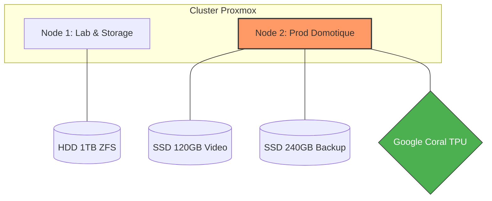

# 🏠 Homelab Infrastructure

## Présentation

Ce dépôt documente mon homelab personnel, conçu pour automatiser mon appartement et expérimenter des technologies d’infrastructure.

Le projet a commencé humblement avec un Raspberry Pi 4 hébergeant Home Assistant. Cependant, avec l’ajout progressif d’intégrations domotiques, de caméras IP et d'automatisations complexes, le Pi a atteint ses limites :

- Surcharge CPU et baisse du framerate vidéo.
- Architecture monolithique (si le Pi tombe, tout s'arrête).
- Point de défaillance unique (SDR/Carte SD).

L’infrastructure a donc évolué vers une architecture virtualisée basée sur Proxmox VE, permettant de séparer les services, d'améliorer la stabilité et de développer mes compétences en administration système.
  
## 🎯 Objectifs du projet

🎯 Objectifs du projet

- Centraliser la domotique de l’appartement de façon robuste.
- Expérimenter les technologies de virtualisation et de conteneurisation (Proxmox, Docker, LXC).
- Apprendre l’administration systèmes Linux en conditions réelles.
- Auto-héberger des services essentiels (Mots de passe, stockage, IA).

## 🖥️ Architecture Matérielle

L'infrastructure repose sur deux nœuds **HP ProDesk** sous **Proxmox VE**, permettant une isolation entre la zone d'expérimentation et les services critiques de la maison.

| Composant | Node 1 (Lab & Stockage) | Node 2 (Production Domotique) |
| :--- | :--- | :--- |
| **Machine** | HP ProDesk | HP ProDesk |
| **Stockage OS** | SSD 256 Go | SSD 256 Go |
| **Stockage Data** | HDD USB 1 To (ZFS) | SSD 120 Go (Caméras) + 240 Go (Backup) |
| **Accélération** | *Aucune* | **Google Coral TPU (USB)** |
| **Rôle principal** | Tests, NAS, IA | Domotique, Sécurité, Proxy |




L’infrastructure repose sur deux serveurs Proxmox afin de séparer les rôles :

- un serveur laboratoire / stockage
- un serveur domotique
  
Architecture simplifiée :

```
Internet
   │
Box Internet
   │
Routeur
   │
Réseau local
   │
├── Proxmox Node 1
│   ├ TrueNAS
│   ├ Docker (tests)
│   ├ Ollama
│   ├ Calibre-Web
│   └ OpenClaw
│
└── Proxmox Node 2
    ├ Home Assistant
    ├ MQTT
    ├ Zigbee2MQTT
    ├ Node-RED
    ├ ESPHome
    ├ Vaultwarden
    ├ Nginx Proxy Manager
    ├ MotionEye
    └ Frigate (Docker + go2rtc)
   ```

## 🖥 Infrastructure matérielle

### Node 1 — serveur laboratoire / stockage

Machine : HP ProDesk

Stockage :

- SSD 256 Go : système Proxmox
- disque USB 1 To : ZFS
  
Services :

- TrueNAS
- Docker (tests)
- OpenClaw
- Ollama

Objectif :

- stockage
- expérimentation
- tests d’applications

### Node 2 — serveur domotique

Machine : HP ProDesk

Stockage :

- SSD 256 Go : VM / LXC
- SSD 240 Go : sauvegardes Proxmox
- SSD 120 Go : stockage caméras (prévu)

Services actifs :

- Home Assistant
- MQTT
- Zigbee2MQTT
- Node-RED
- ESPHome
- Vaultwarden
- Nginx Proxy Manager
- MotionEye
- Frigate

Services installés mais non encore utilisés :

- Grafana
- MariaDB
- WireGuard
- Tailscale
- Cloudflared

## 🏠 Domotique

L’infrastructure domotique repose sur plusieurs services interconnectés.

Architecture :

```
Zigbee devices
      │
Zigbee2MQTT
      │
MQTT broker
      │
Home Assistant
      │
Node-RED
```

Objectif :

- automatiser les scénarios domotiques
- centraliser les équipements
- intégrer capteurs et actionneurs.

## 🎥 Vidéosurveillance

Le système de vidéosurveillance repose sur deux solutions.

### Frigate

NVR basé sur l’IA utilisant :
- Docker
- go2rtc
- Google Coral TPU (USB)

Déploiement :

```
Proxmox
   │
LXC Debian
   │
Docker
   │
Frigate + go2rtc
```

Fonctions :

- détection d’objets
- analyse vidéo locale
- intégration avec Home Assistant

### MotionEye

MotionEye est utilisé pour :

- visualiser les flux RTSP
- monitorer les caméras

## 📷 Caméras

Caméras utilisées :

- 2x Xiaomi Yi 1080p (firmware yi-hack)
- Reolink E1 Zoom
- Reolink E1 Pro

Protocoles :

- RTSP
- ONVIF (via go2rtc pour certaines caméras)

Architecture vidéo :

```
Caméras IP
   │
RTSP / ONVIF
   │
go2rtc
   │
├ Frigate (détection IA)
└ MotionEye (visualisation)
```

## 💾 Sauvegardes

Sauvegardes actuelles :

```
Proxmox Backup
   ↓
SSD local 240 Go
```

Évolution prévue :

````
Proxmox Backup
   ↓
NAS TrueNAS
````

## 🧠 Compétences développées

Ce homelab m’a permis de travailler sur :

- virtualisation
- conteneurs
- infrastructure Linux
- stockage NAS
- domotique
- vidéosurveillance locale
- automatisation

Technologies utilisées :

- Proxmox VE
- Docker
- Home Assistant
- TrueNAS
- Frigate
- Node-RED
  
## 🚀 Prochaines évolutions

Améliorations prévues :

- activation de l’enregistrement vidéo Frigate
- monitoring de l’infrastructure
- accès distant sécurisé
- sauvegardes NAS
- supervision du homelab

## 👨‍💻 Contexte

Ce projet est né à l’origine d’un besoin simple : automatiser mon appartement.

La première version reposait sur un Raspberry Pi 4 exécutant Home Assistant.

Avec le temps, plusieurs besoins sont apparus :

- ajout d’équipements domotiques
- automatisations plus complexes
- intégration de caméras IP
- expérimentation de nouveaux services

Les limites du Raspberry Pi (ressources limitées et point de défaillance unique) ont conduit à migrer vers une infrastructure virtualisée basée sur Proxmox VE.

Aujourd’hui, ce homelab sert à :

- gérer la domotique
- tester de nouveaux services auto-hébergés
- expérimenter différentes architectures
Plusieurs services sont actuellement installés mais encore en phase de test ou de déploiement, afin d’explorer différentes solutions et comprendre leur fonctionnement.
