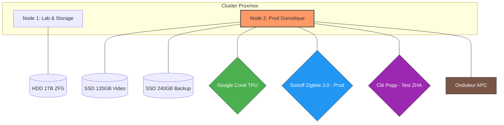

# 🏠 Homelab Infrastructure

## Présentation

Ce dépôt documente mon homelab personnel, conçu pour automatiser mon appartement et expérimenter des technologies d’infrastructure.

Le projet a commencé humblement avec un Raspberry Pi 4 hébergeant Home Assistant. Cependant, avec l’ajout progressif d’intégrations domotiques, de caméras IP et d'automatisations complexes, le Pi a atteint ses limites :

- Surcharge CPU et baisse du framerate vidéo.
- Architecture monolithique (si le Pi tombe, tout s'arrête).
- Point de défaillance unique (SDR/Carte SD).

L’infrastructure a donc évolué vers une architecture virtualisée basée sur Proxmox VE, permettant de séparer les services, d'améliorer la stabilité et de développer mes compétences en administration système.
  
## 🎯 Objectifs du projet

- Centraliser la domotique de l’appartement de façon robuste.
- Expérimenter les technologies de virtualisation et de conteneurisation (Proxmox, Docker, LXC).
- Apprendre l’administration systèmes Linux en conditions réelles.
- Auto-héberger des services essentiels (Mots de passe, stockage, IA).

## 🖥️ Architecture Matérielle

L'infrastructure repose sur deux nœuds **HP ProDesk** sous **Proxmox VE**, permettant une isolation entre la zone d'expérimentation et les services critiques de la maison.

| Composant | Node 1 (Lab & Stockage) | Node 2 (Production Domotique) |
| :--- | :--- | :--- |
| **Machine** | HP ProDesk | HP ProDesk |
| **Stockage OS** | SSD 256 Go | SSD 256 Go |
| **Stockage Data** | HDD USB 1 To (ZFS) | SSD 120 Go (Caméras) + 240 Go (Backup) |
| **Accélération** | *Aucune* | **Google Coral TPU (USB)** |
| **Zigbee 2** | *Aucun* | Sonoff Zigbee 3.0 Dongle Plus (P) |
| **Zigbee 2** | *Aucun* | Sonoff Zigbee 3.0 Dongle Plus (P) |
| **Onduleur** |	*Aucun* | Onduleur APC (UPS) |
| **Rôle principal** | Tests, NAS, IA | Domotique, Sécurité, Proxy |



L’infrastructure repose sur deux serveurs Proxmox afin de séparer les rôles :

- un serveur laboratoire / stockage
- un serveur domotique
  
Architecture simplifiée :

```text
Internet
   │
Box Internet
   │
Routeur
   │
Réseau local
   │
├── Proxmox Node 1 : ludok (Lab & Stockage)
│   ├── 100 : TrueNAS (Stockage ZFS)
│   ├── 101 : Ollama (IA Locale)
│   ├── 102 : Docker (Tests)
│   ├── 103 : Calibre-Web
│   ├── 104 : OpenClaw
│   └── 105 : Nextcloud-VM
│
└── Proxmox Node 2 : proxmox (Domotique & Sécurité)
    ├── 100 : HAOS (Home Assistant)
    ├── 101/102 : MQTT / Zigbee2MQTT
    ├── 103 : MotionEye
    ├── 104 : Vaultwarden
    ├── 105 : Nginx Proxy Manager
    ├── 106 : ESPHome
    ├── 108 : Frigate 🚀 (Accélération Coral TPU)
    ├── 109 : go2rtc
    ├── 110 : Cloudflared
    ├── 111 : MariaDB
    ├── 112 : WireGuard
    ├── 113 : Grafana
    ├── 114 : Tailscale
    ├── 115 : Node-Red (Docker)
    └── 116 : InfluxDB
   ```

## 🖥 Infrastructure matérielle

### Node 1 — serveur laboratoire / stockage

Machine : HP ProDesk

Stockage :

- SSD 256 Go : système Proxmox
- disque USB 1 To : ZFS
  
Services :

- TrueNAS
- Docker (tests)
- OpenClaw
- Ollama

Objectif :

- stockage
- expérimentation
- tests d’applications

### Node 2 — serveur domotique

Machine : HP ProDesk

Stockage :

- SSD 256 Go : VM / LXC
- SSD 240 Go : sauvegardes Proxmox
- SSD 120 Go : stockage caméras (prévu)

Services actifs :

- Home Assistant
- MQTT
- Zigbee2MQTT
- Node-RED
- ESPHome
- Vaultwarden
- Nginx Proxy Manager
- MotionEye
- Frigate

Services installés mais non encore utilisés :

- Grafana
- MariaDB
- WireGuard
- Tailscale
- Cloudflared

## ⚙️ Stack Logicielle & Flux de Données

L'infrastructure domotique est conçue pour être indépendante du cloud et centrée sur la réactivité locale.

### 🎥 Vidéosurveillance & Analyse IA

Le système de sécurité est conçu pour être 100% local, performant et intelligent. Il repose sur une architecture en cascade qui optimise le décodage matériel du i5-7500T et la puissance d'inférence du Google Coral.

- Entrée (go2rtc) : Centralise les flux RTSP (Xiaomi Yi via firmware hack) et ONVIF (Reolink). Il agit comme un pivot pour redistribuer la vidéo sans solliciter les caméras plusieurs fois.
- Traitement IA (Frigate) : Récupère les flux depuis go2rtc. Utilise le Google Coral TPU pour la détection d'objets et l'iGPU Intel (HD 630) pour le décodage matériel.
- Visualisation (MotionEye) : Affiche une mosaïque légère des flux redistribués par go2rtc.

### 📷 Sources & Protocoles

Le parc de caméras est hétérogène mais unifié par des protocoles standards.

- Matériel :
    - 2x Xiaomi Yi 1080p : Libérées du cloud via le firmware yi-hack pour un accès RTSP.
    - Reolink E1 Zoom & Pro : Haute résolution intégrée via ONVIF.

- Protocoles : RTSP pour le flux continu et ONVIF pour le contrôle et les snapshots.
    
### 🛠️ Pile Logicielle & Déploiement

L'isolation des services est assurée par une structure stratifiée sur Proxmox.

- Frigate : NVR intelligent gérant la détection d'objets.
- go2rtc : Gestionnaire de flux pour la redistribution sans latence.
- Google Coral TPU : Accélérateur USB dédié aux calculs d'IA.

Structure de déploiement :

```Plaintext
Proxmox (Hyperviseur)
   │
   └── LXC Debian (Conteneur privilégié)
         │
         └── Docker (Moteur de conteneurisation)
               │
               └── Frigate + go2rtc (Services isolés)
```

### 📷 Gestion des Flux (Architecture Vidéo)

Pour optimiser les ressources, go2rtc agit comme un pivot central (Proxy RTSP). Il évite de saturer les processeurs des caméras en distribuant un flux unique vers plusieurs clients.

```plaintext
Caméras IP (Xiaomi / Reolink)
   │
   ▼
[ go2rtc ] ─── (Récupération unique des flux RTSP/ONVIF)
   │
   ├──▶ [ Frigate ] ───▶ Détection IA (Personnes, Voitures) via Coral TPU
   │
   └──▶ [ MotionEye ] ──▶ Visualisation Live & Monitoring
```

### 🚀 Optimisation Matérielle

- Décodage (iGPU) : Le processeur i5-7500T utilise son circuit graphique intégré (Intel HD 630) pour décharger le CPU du rendu vidéo.
- Inférence (Coral TPU) : Le module USB traite l'analyse d'image (reconnaissance de personnes, objets) en déchargeant totalement le processeur principal.
    
## 🤖 Flux Domotique (IoT)

La communication entre les capteurs et l'interface utilisateur repose sur une architecture en étoile via le protocole MQTT.

- Protocoles : Les capteurs communiquent via Zigbee2MQTT (101/107) ou ESPHome (106).
- Bus de données : Le broker MQTT (101) centralise tous les messages en temps réel.
- Intelligence : Home Assistant (100) et Node-RED (115) traitent ces messages pour déclencher les automatisations.

Architecture logique :

```Plaintext
[ Capteurs ] ──▶ [ Zigbee2MQTT / ESPHome ] ──▶ [ MQTT Broker ] ──▶ [ Home Assistant ]
```

#### 🌿 Focus Projet : Smart Balcony Monitoring**
Ce dépôt intègre un sous-projet dédié au suivi environnemental d'un balcon connecté. Il utilise des capteurs Zigbee pour monitorer la santé des plantations (température, humidité) et transforme les données brutes en scores de santé dynamiques dans Home Assistant.**
- [Consulter le dépôt dédié Smart Balcony](./Home-assistant/smart-balcony)

#### Stratégie IoT Hybride : 
Pour garantir la stabilité de l'appartement tout en continuant d'expérimenter, le Node 2 gère deux réseaux Zigbee indépendants :

   - Production : Basé sur une clé Sonoff et Zigbee2MQTT, pour une gestion fine et découplée de Home Assistant.
   - Laboratoire : Une clé Popp Zigbee directement intégrée à l'instance ZHA de Home Assistant, permettant de tester rapidement de nouveaux capteurs sans risquer de perturber le réseau principal.

## 📊 Monitoring & Historisation

Pour le suivi à long terme, les données sont extraites et visualisées via une stack dédiée.

- Stockage : Les états sont historisés dans MariaDB (111) et les métriques temporelles dans InfluxDB (116).
- Visualisation : Grafana (113) génère des tableaux de bord pour l'analyse des consommations et de l'état des serveurs.

## 💾 Stratégie de Sauvegarde & Résilience

La sécurité des données est automatisée pour garantir une restauration fiable sans intervention manuelle.

### 🔄 État Actuel : Sauvegarde Automatisée

Actuellement, le Node 2 assure sa propre protection via un stockage physique dédié.

   - Support : SSD 240 Go dédié aux backups Proxmox.
   - Méthode : Mode Instantané (Snapshot) avec compression ZSTD (optimisée pour la rapidité et le poids).
   - Fréquence : Sauvegardes complètes hebdomadaires des VM (HAOS) et LXC (Vaultwarden, NPM, etc.).
   - Rétention : Stratégie de rotation pour conserver les versions critiques récentes.

```Plaintext
[ Services Node 2 ] ──(Dump Hebdomadaire)──▶ [ SSD 240 Go Local ]
```

### 🚀 Évolution Cible : Règle du 3-2-1

L'objectif est d'externaliser les sauvegardes sur le Node 1 pour éliminer le point de défaillance unique (SPOF) du serveur de production.

   - Cible : Montage d'un partage réseau (NFS/SMB) provenant de TrueNAS (Node 1).
   - Sécurité : Stockage sur le pool ZFS (HDD 1 To) pour bénéficier de l'intégrité des données et de la protection contre la corruption silencieuse (bit rot).
   - Résilience : En cas de panne majeure du Node 2, les services pourront être restaurés et redémarrés directement sur le Node 1.

```Plaintext
[ Node 2 : Prod ] ──────(Réseau LAN)──────▶ [ Node 1 : TrueNAS ]
      │                                           │
      └── VM/LXC Backup ──────────────────────────▶ Pool ZFS (1 To)
```

## 🚀 Prochaines évolutions

   - Sauvegarde de Configuration (Option B) : Mise en place d'une synchronisation quotidienne via rsync. L'objectif est de copier chaque nuit les dossiers /config (YAML, scripts) du Node 2 vers le Node 1 (TrueNAS) pour permettre une restauration granulaire entre deux sauvegardes hebdomadaires Proxmox.
   - Externalisation des Backups : Automatisation du transfert des images Proxmox (.vma.zst) vers le pool ZFS du Node 1 pour éliminer le point de défaillance unique du serveur de production.
   - Finalisation Frigate : Activation de l’enregistrement vidéo continu sur détection et affinage des zones de mouvement.
   - Observabilité & Supervision : Déploiement complet de la stack Monitoring (InfluxDB, MariaDB, Grafana) pour centraliser les métriques de santé du cluster.
   - Accès Distant Sécurisé : Configuration d'un accès hors-domicile via tunnel chiffré (WireGuard ou Tailscale).

## 👨‍💻 Contexte & Origine

L'origine de ce projet remonte à la lecture d'un très vieux magazine d'électronique (que je dois encore retrouver !) qui expliquait comment construire soi-même son propre module domotique. Cette curiosité initiale s'est transformée en un besoin concret : automatiser mon appartement.

La première version "moderne" reposait sur un Raspberry Pi 4. Cependant, l'ajout progressif d'équipements, d'automatisations complexes et de caméras IP a rapidement montré les limites du Pi (CPU saturé, instabilité de la carte SD).

La migration vers une infrastructure virtualisée sous Proxmox VE a transformé ce besoin en un véritable laboratoire personnel. Aujourd'hui, ce homelab ne se contente plus de gérer la domotique ; il me permet d'explorer, de tester et de comprendre en profondeur les architectures auto-hébergées et les systèmes Linux.

## 📖 Documentation Détaillée

*   [🛠️ Détails du Matériel & Clés USB](./docs/hardware.md)
*   [💾 Stratégie de Sauvegarde (Rsync)](./docs/backup-option-b.md)
*   [⚡ Projet : Résilience électrique (UPS/NUT)](./docs/ups-nut.md)
*   [🌿 Projet : Smart Balcony Monitoring (Dépôt externe)](./Home-assistant/smart-balcony)
